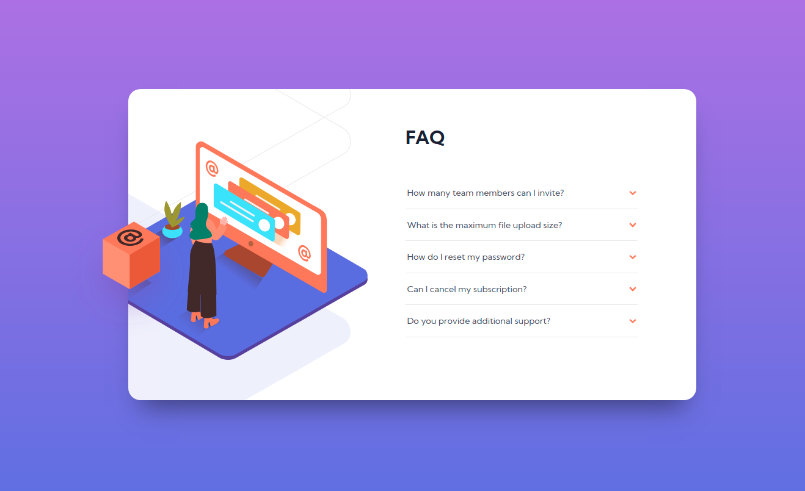

## Table of contents

- [Overview](#overview)
  - [The challenge](#the-challenge)
  - [Screenshot](#screenshot)
- [My process](#my-process)
  - [Built with](#built-with)
  - [What I learned](#what-i-learned)
  - [Continued development](#continued-development)
- [Author](#author)

## Overview

### The challenge

Users should be able to:

- View the optimal layout for the component depending on their device's screen size
- See hover states for all interactive elements on the page
- Hide/Show the answer to a question when the question is clicked

### Screenshot

### Links

- Solution URL: [Solution](https://your-solution-url.com)
- Live Site URL: [Live site URL](https://github.com/mlzzi/faq-accordion-card-main)

## My process

### Built with

- Semantic HTML5 markup
- CSS custom properties
- Flexbox
- Mobile-first workflow

### What I learned

First project with Javascript. It is a simple javascript code, but I'm satisfied that I started to use it.

### Continued development

Further projects I want to apply more complex Javascript.

## Author

- Linkedin - [Murilo Luzzi](https://www.linkedin.com/in/muriloluzzi/)
- Frontend Mentor - [@mlzzi](https://www.frontendmentor.io/profile/mlzzi)
